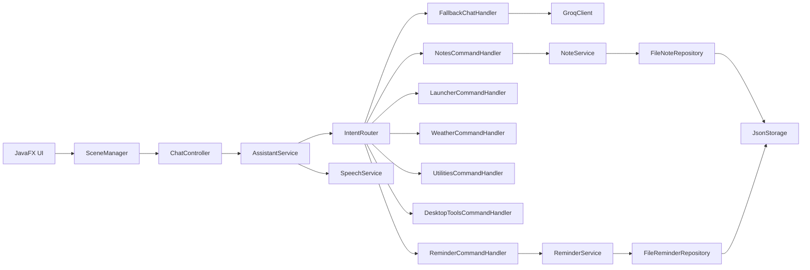

# Architecture

EDITH-J is organized around a single assistant orchestration layer.

## Flow

## Packages

- `com.edithj.app` bootstraps JavaFX.
- `com.edithj.ui.navigation` loads FXML scenes.
- `com.edithj.ui.controller` contains thin JavaFX controllers.
- `com.edithj.assistant` owns intent routing and voice/text orchestration.
- `com.edithj.commands` contains intent handlers.
- `com.edithj.notes` and `com.edithj.reminders` own domain logic and repositories.
- `com.edithj.speech` handles capture, transcription, and typed fallback.
- `com.edithj.launcher` encapsulates OS launch behavior.
- `com.edithj.storage` provides JSON persistence.
- `com.edithj.integration.llm` contains the Groq client and prompt loading.

## Design Notes

- Chat input now routes through `AssistantService` instead of calling the LLM client directly.
- Voice input also funnels through `AssistantService`, which preserves the same command routing used by typed input.
- Notes and reminders stay in the service layer; controllers only adapt data for the UI.
- Storage defaults to a writable user directory at `~/.edith-j/data/`.
